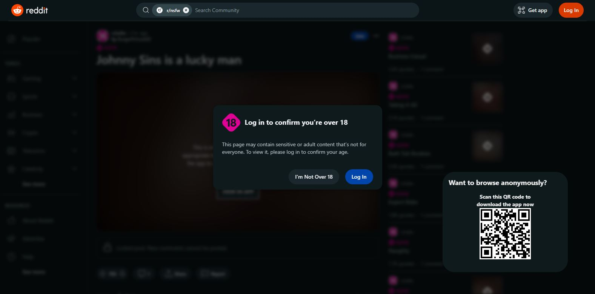
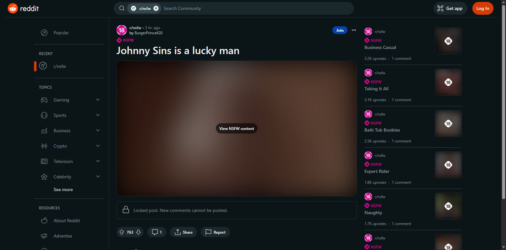

  

# reddit-nsfw-unblocker

Unblock and remove those pesky little popups and blurs to freely view NSFW content! No login required. Works with the new Reddit (Beta) UI.

## Examples

### For a subreddit

Before:

After:

### For a post

Before:

After:

## How it works

It simply manipulates the DOM - removes elements responsible for the popup and blur, re-enables scrolling and removes a NSFW prompt/warning inside the video player.

See the source: [unblocker.js](src/js/unblocker.js)
