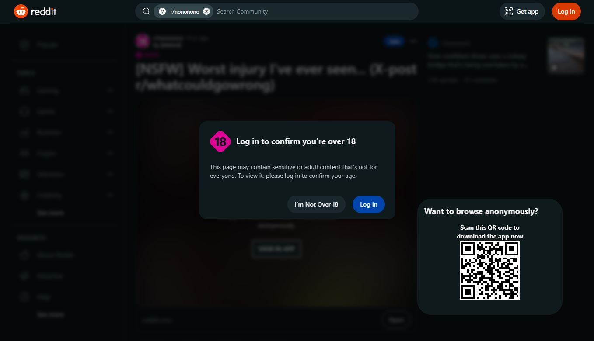
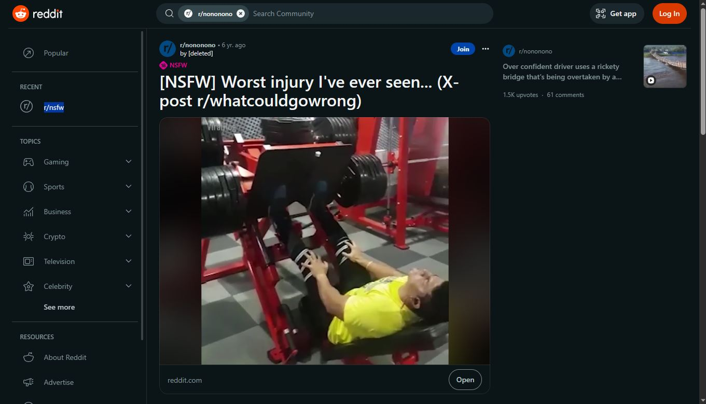

  

# reddit-nsfw-unblocker

A browser extension to unblock and remove those pesky little popups and blurs to freely view NSFW content! No login required. Works with the new Reddit (Beta) UI.

Supports `reddit.com/r/*` and `reddit.com/user/*` links. Create an issue if you want support for more links.

Available for [Firefox](https://addons.mozilla.org/de/firefox/addon/reddit-nsfw-unblocker/). Edge and Chrome soonTM.

## Example

Before:

After:

## How it works

It simply manipulates the DOM - removes elements responsible for the popup and blur, re-enables scrolling and removes a NSFW prompt/warning inside the video player.

See the source: [unblocker.js](src/js/unblocker.js)
